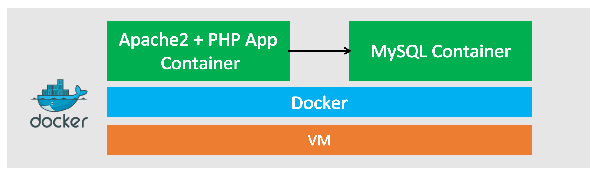
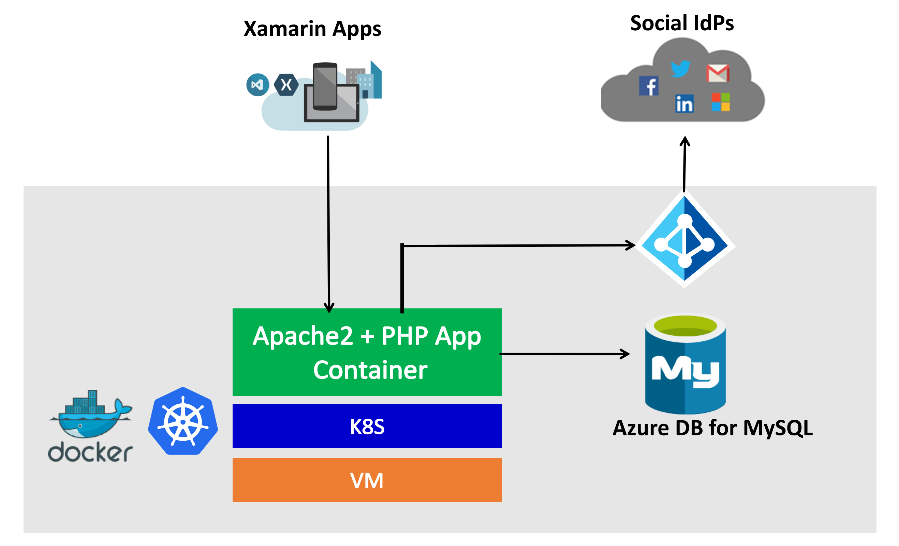

# OSS-CAD-Handson-TeamA
[Temporary Repo] OSS Cloud App Dev Team-A Hands-on

## Table of Contents
### 1. Intro and Prerequisites
- About Gallery 3:
  - [Gallery 3](http://galleryproject.org/) is an open source photo sharing web application, based on PHP and MySQL.
  - [Gallery 3 Github Repo](https://github.com/gallery/gallery3)
- Architecture (before/after)
  - before
  
  - after
  

- Prerequisites
  - Linux VM & Azure CLI: [Create an Azure Linux VM for container app developement](module1/deploy-linuxvm.md)
  - Docker: [Install Docker using Azure Extensions](module1/azdockerinstall.md)

### 2. Dockernize Gallery 3 Application
- [Dockernize and run Gallery3 App on the VM](https://github.com/rioriost/kd_gallery3/)

### 3. Azure Database for MySQL/PostgreSQL
- [Create Azure Database for MySQL account and configure](module3/setup-azdb4mysql.md)
- [Configure the App to connect to Azure Database for MySQL](module3/configure-app-for-azdb4mysql.md)

### 4. Kubernates on ACS
- [k8s on ACS Setup](module4/k8s-setup.md)
- [Deploy Gallery3 App Container on k8s](module4/deploy-app-to-k8s.md)

### 5. Azure AD B2C
- [Azure AD B2C Setup](module5/azadb2c-setup.md)
- [Extends Gallery3 authentication with Azure AD B2C](https://github.com/yokawasa/gallery3-openid-azureadb2c-module#how-to-enable-the-module-in-gallery-3)

### 6. Xamarin 
- [Xamarin.Forms Gallery3 client app](module6/xamarin-Forms-client-app.md)
- [Azure Mobile Center](module6/mobile-center.md)

 
 

