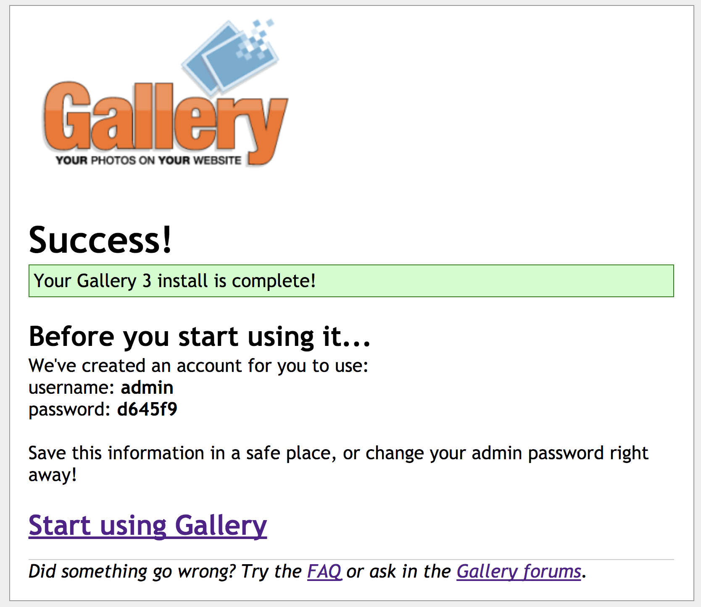

# Dockernize Gallery 3 Application

## 1.  Build the conatiner image for gallery3 and run the container on your docker environment
```
$ git clone https://github.com/rioriost/kd_gallery3

$ cd kd_gallery3

$ docker build --tag kd_gallery3 .

$ docker run --rm -p 8080:80 --hostname myhost.domaint -it kd_gallery3

```
Once you run container from kd_gallery3 image, access to http://localhost:8080


## 2. Add your local mysql user name, 

you'll see the page below when you access to http://localhost:8080 initially.


Then, you need to pass the parametars to connect gallery3 to MySQL such as User, password, Hostname and port number (if needed) in installation page. if the installation complete successfully, you'll see the page like below (Don't forget to take a note of admin user and password shown on the page):



