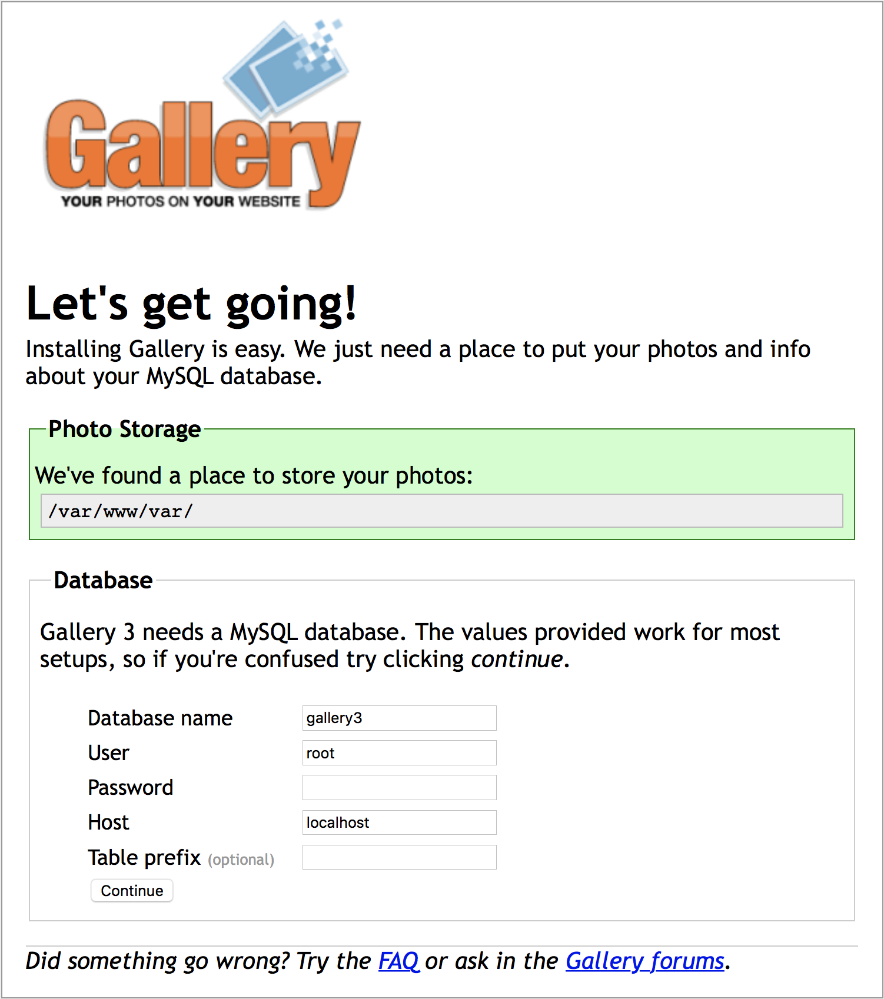
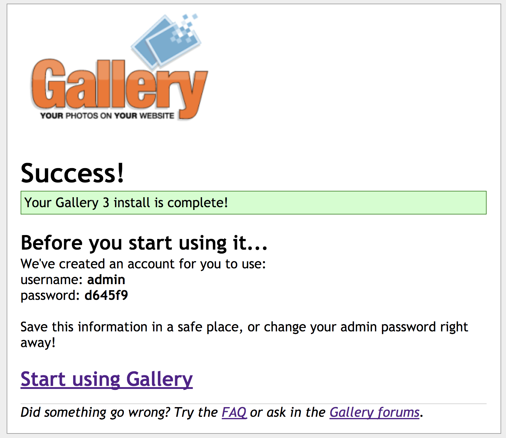

# Configure the App to connect to Azure Database for MySQL

## 1. Start a new container
Start a new constainer from the Gallery3 container image you created in the previous module.

At first login to Gallery3 app, and you'll see the following initial setup page. 

Then, type in the user name, password, and hostname of the Azure DB for MySQL account that you just created in previous section. If the installation complete successfully, you'll see the page like below again (Don't forget to take a note of admin user and password shown on the page):

